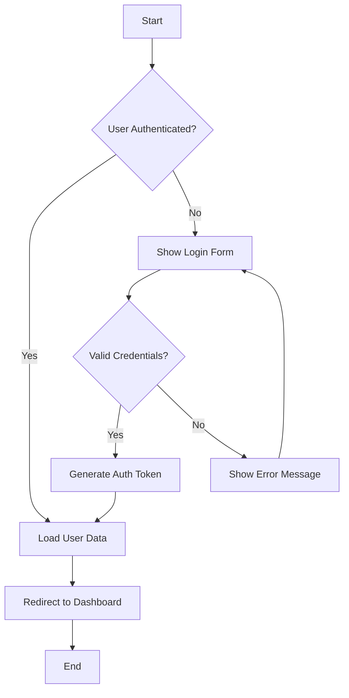
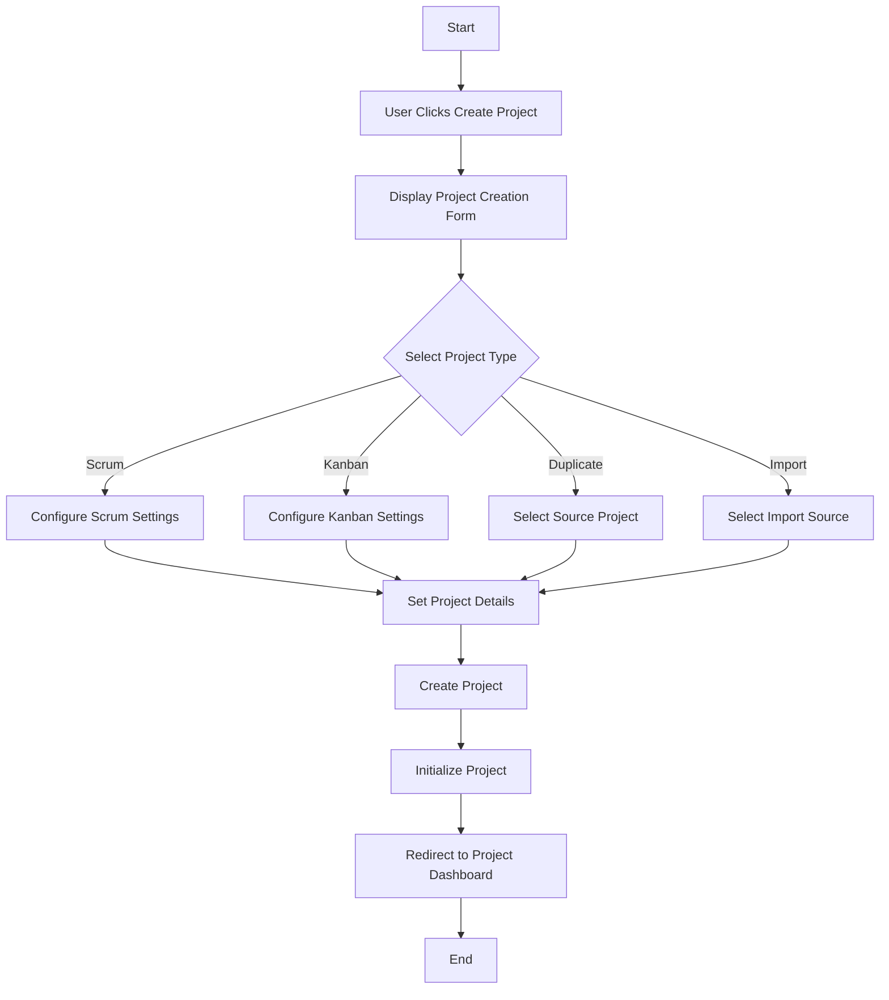
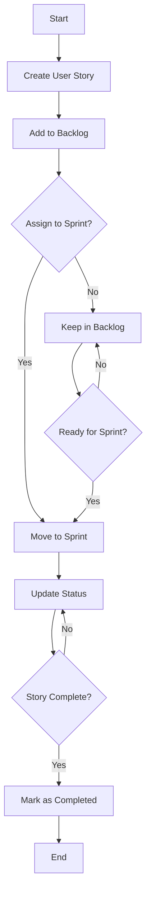
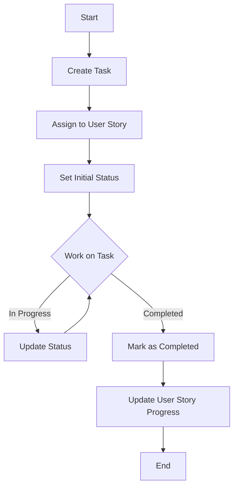
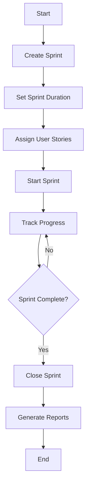

# Activity Diagrams

This document contains activity diagrams that illustrate the main workflows in the Taiga front-end application.

## Table of Contents

1. [User Authentication Flow](#user-authentication-flow)
2. [Project Creation Flow](#project-creation-flow)
3. [User Story Lifecycle](#user-story-lifecycle)
4. [Task Management Flow](#task-management-flow)
5. [Sprint Management Flow](#sprint-management-flow)

## User Authentication Flow

The authentication flow in Taiga begins by checking if the user is already authenticated. If they are, the application loads the user data and redirects to the dashboard. If not, the login form is displayed. When the user submits their credentials, the application validates them. If valid, an authentication token is generated, user data is loaded, and the user is redirected to the dashboard. If invalid, an error message is displayed, and the user can try again.

## Project Creation Flow

The project creation flow starts when a user clicks the "Create Project" button. The application displays a form where the user can select the project type (Scrum, Kanban, Duplicate, or Import). Depending on the selection, the user configures specific settings. After setting project details, the project is created, initialized, and the user is redirected to the project dashboard.

## User Story Lifecycle

The user story lifecycle begins with creation and addition to the backlog. The user story can then be assigned to a sprint or kept in the backlog until it's ready. Once in a sprint, its status is updated as work progresses. When all tasks are completed, the user story is marked as completed.

## Task Management Flow

The task management flow starts with task creation and assignment to a user story. The task is given an initial status, and as work progresses, the status is updated. When the task is completed, it's marked as such, and the progress of the associated user story is updated.

## Sprint Management Flow

The sprint management flow begins with sprint creation and setting its duration. User stories are assigned to the sprint, and the sprint is started. Progress is tracked throughout the sprint. When the sprint is complete, it's closed, and reports are generated.
