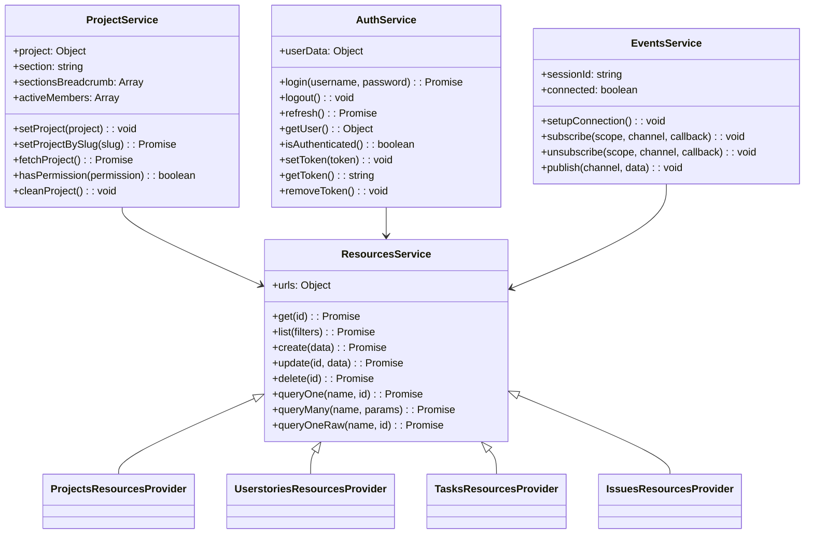
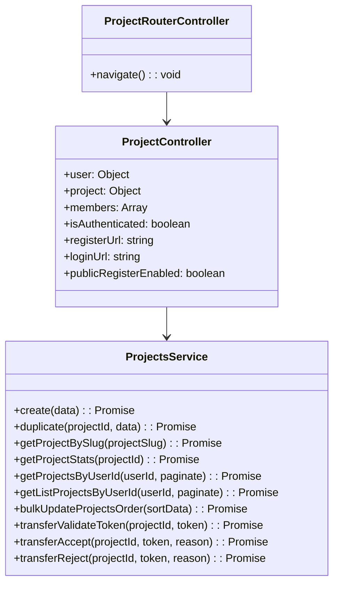
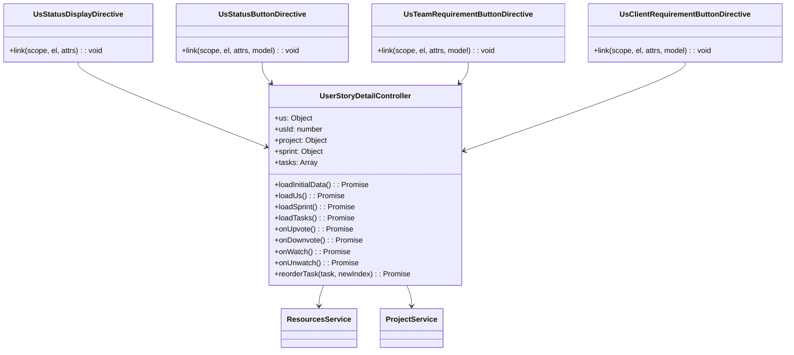
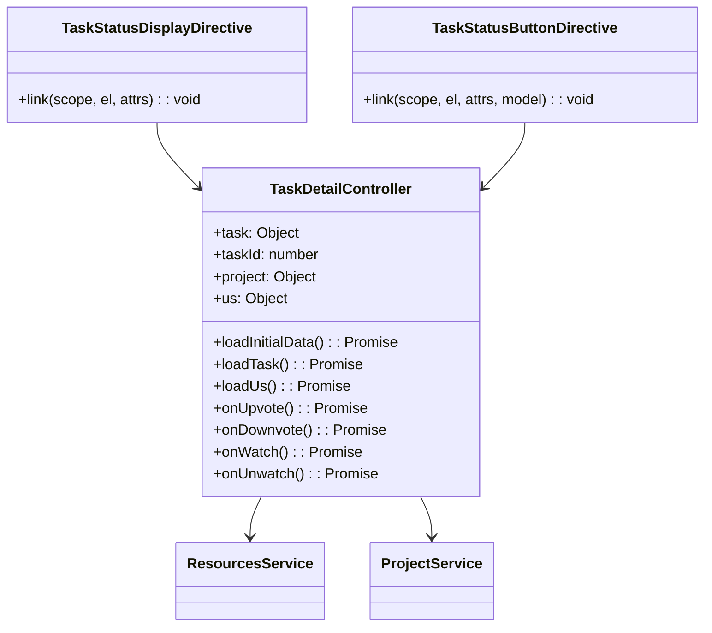
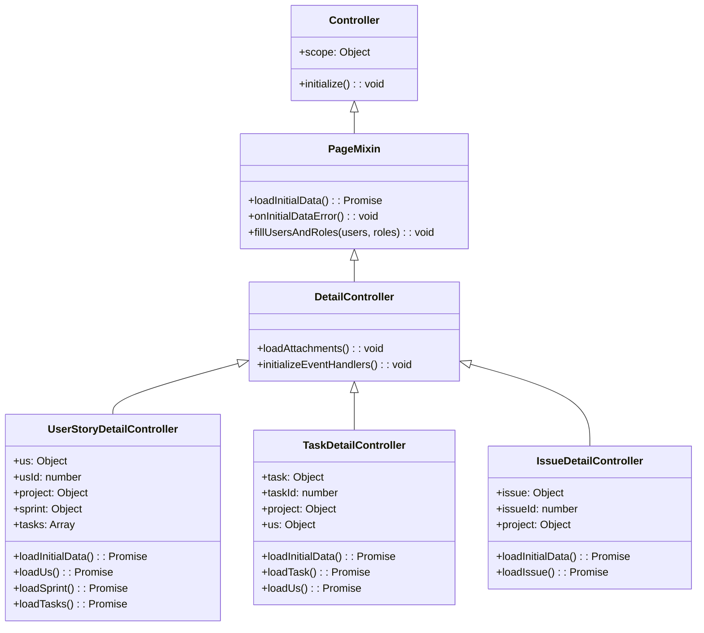

# Class Diagrams

This document contains class diagrams that illustrate the class structure in the Taiga front-end application. Note that since Taiga is built with AngularJS and CoffeeScript, these diagrams represent the conceptual class structure rather than actual class definitions.

## Table of Contents

1. [Core Services](#core-services)
2. [Project Module](#project-module)
3. [User Story Module](#user-story-module)
4. [Task Module](#task-module)
5. [Controller Hierarchy](#controller-hierarchy)

## Core Services

The core services in Taiga include ResourcesService, which handles API communication, AuthService, which manages authentication, EventsService, which handles real-time events, and ProjectService, which manages project data. ResourcesService is extended by various resource providers for specific entity types.

## Project Module

The Project module includes ProjectsService, which provides methods for project operations, ProjectController, which manages project data for the view, and ProjectRouterController, which handles project navigation.

## User Story Module

The User Story module includes UserStoryDetailController, which manages user story data for the view, and various directives for displaying and updating user story properties.

## Task Module

The Task module includes TaskDetailController, which manages task data for the view, and directives for displaying and updating task properties.

## Controller Hierarchy

The controller hierarchy in Taiga includes a base Controller class, a PageMixin that adds common page functionality, a DetailController that adds common detail functionality, and specific controllers for different entity types.
