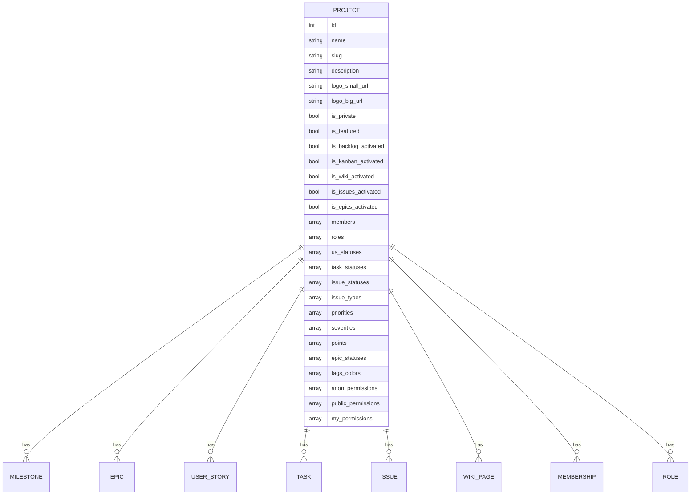
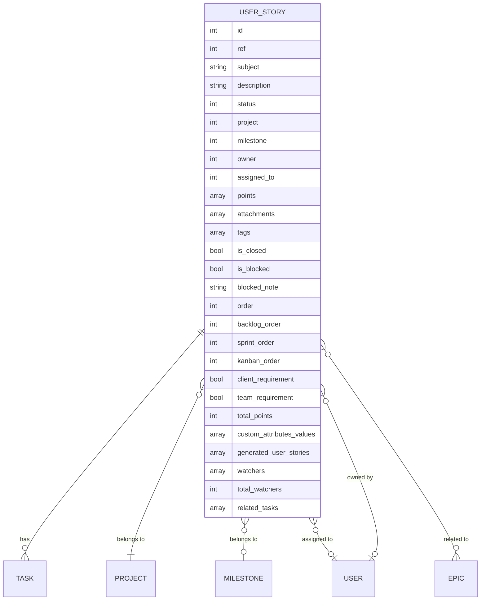
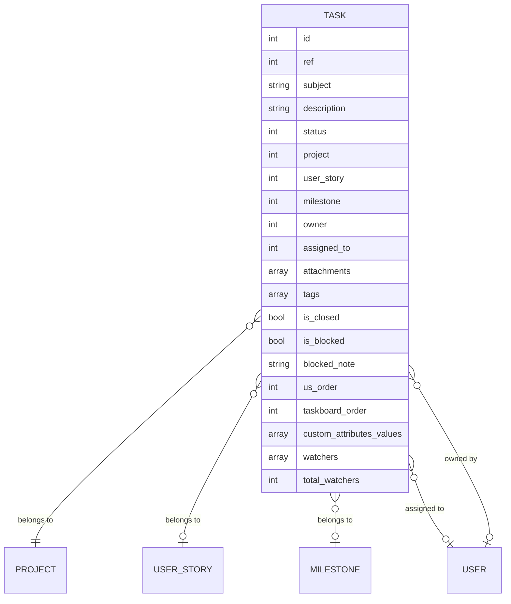
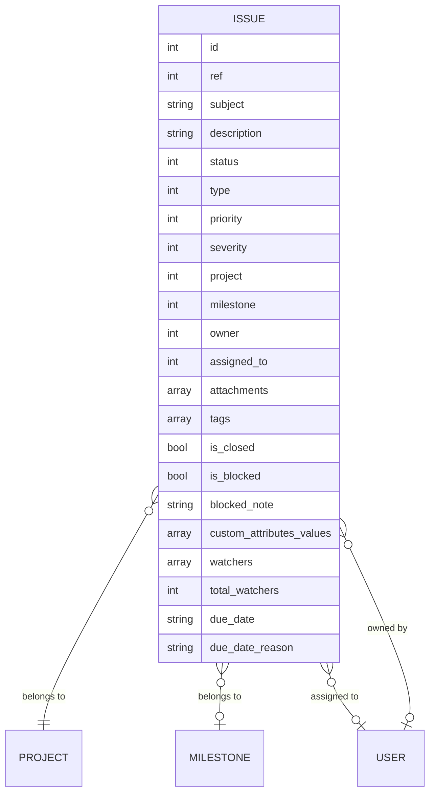
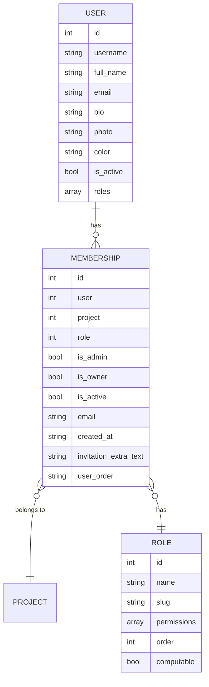

# Entity Relationship Diagrams

This document contains entity relationship diagrams that illustrate the data models in the Taiga front-end application. Note that these diagrams represent the client-side data models, which may differ slightly from the server-side database schema.

## Table of Contents

1. [Project Model](#project-model)
2. [User Story Model](#user-story-model)
3. [Task Model](#task-model)
4. [Issue Model](#issue-model)
5. [User and Membership Model](#user-and-membership-model)

## Project Model

The Project model is the central entity in Taiga. It contains all the information about a project, including its name, description, and various settings. It also contains references to all the other entities in the system, such as milestones, epics, user stories, tasks, issues, wiki pages, memberships, and roles.

## User Story Model

The User Story model represents a user story in Taiga. It contains information such as the subject, description, status, and points. It also contains references to related entities such as the project, milestone, owner, assigned user, and related tasks.

## Task Model

The Task model represents a task in Taiga. It contains information such as the subject, description, status, and order. It also contains references to related entities such as the project, user story, milestone, owner, and assigned user.

## Issue Model

The Issue model represents an issue in Taiga. It contains information such as the subject, description, status, type, priority, and severity. It also contains references to related entities such as the project, milestone, owner, and assigned user.

## User and Membership Model

The User model represents a user in Taiga. It contains information such as the username, full name, email, and roles. The Membership model represents a user's membership in a project. It contains information such as the user, project, role, and whether the user is an admin or owner of the project. The Role model represents a role in Taiga, which defines a set of permissions.
