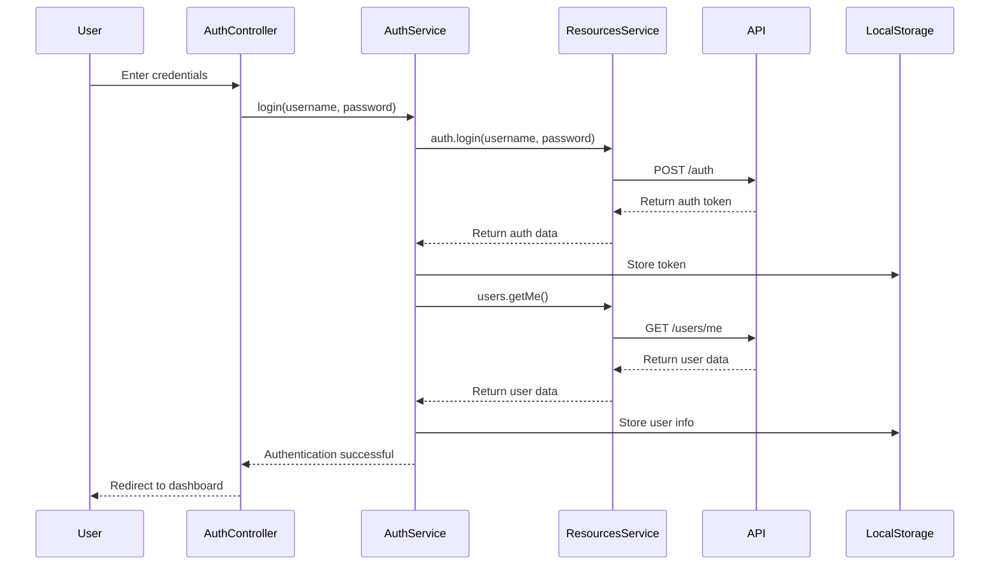
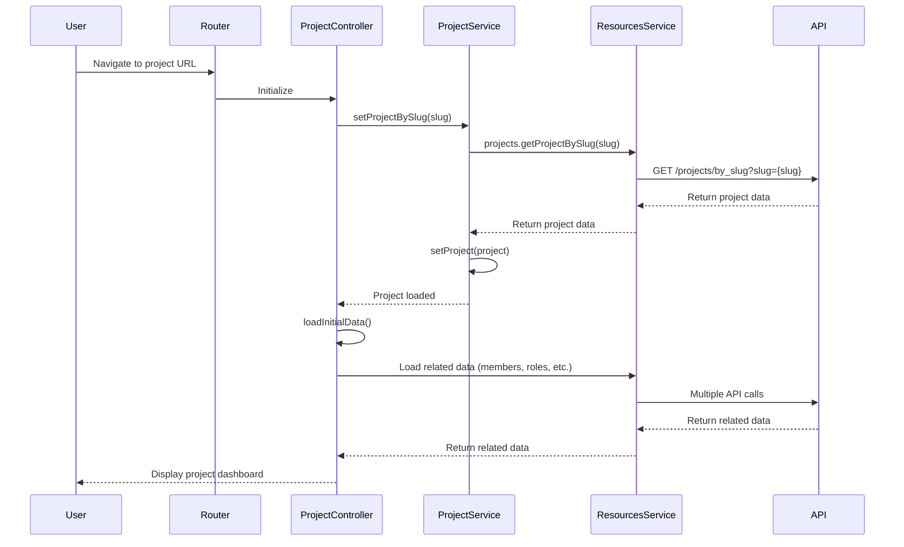
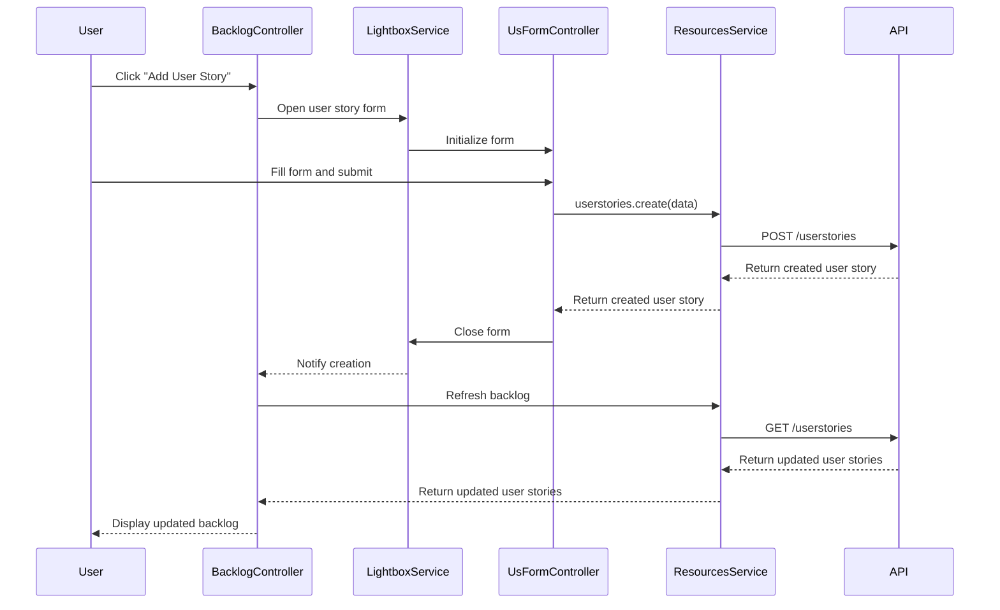
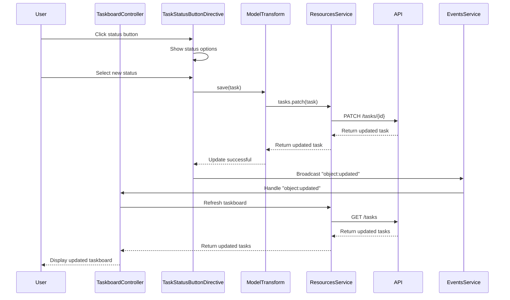
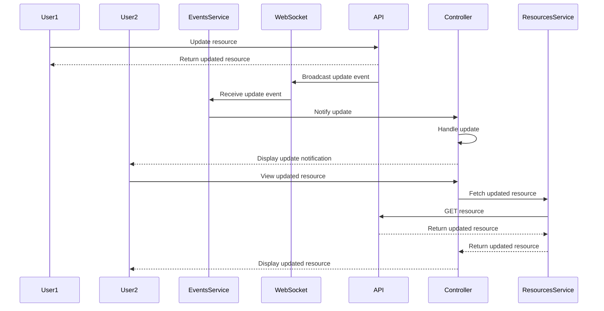

# Sequence Diagrams

This document contains sequence diagrams that illustrate the interactions between components in the Taiga front-end application.

## Table of Contents

1. [User Authentication Sequence](#user-authentication-sequence)
2. [Project Loading Sequence](#project-loading-sequence)
3. [User Story Creation Sequence](#user-story-creation-sequence)
4. [Task Status Update Sequence](#task-status-update-sequence)
5. [Real-time Updates Sequence](#real-time-updates-sequence)

## User Authentication Sequence

This sequence diagram illustrates the authentication process in Taiga. When a user enters their credentials, the AuthController passes them to the AuthService, which uses the ResourcesService to make an API call. Upon successful authentication, the API returns an auth token, which is stored in LocalStorage. The AuthService then fetches the user data and stores it in LocalStorage as well. Finally, the user is redirected to the dashboard.

## Project Loading Sequence

This sequence diagram shows how a project is loaded when a user navigates to a project URL. The Router initializes the ProjectController, which uses the ProjectService to fetch the project data by slug. The ProjectService makes an API call through the ResourcesService, and upon receiving the project data, sets it in the ProjectService. The ProjectController then loads related data such as members and roles, and finally displays the project dashboard to the user.

## User Story Creation Sequence

This sequence diagram illustrates the process of creating a user story. When a user clicks "Add User Story" in the BacklogController, a form is opened using the LightboxService. The user fills out the form and submits it, which triggers the UsFormController to create the user story through the ResourcesService. After the API returns the created user story, the form is closed, and the BacklogController refreshes the backlog to display the updated list of user stories.

## Task Status Update Sequence

This sequence diagram shows the process of updating a task's status. When a user clicks a status button in the TaskStatusButtonDirective, they are shown status options. After selecting a new status, the ModelTransform service is used to save the task through the ResourcesService. Upon successful update, an "object:updated" event is broadcast through the EventsService, which triggers the TaskboardController to refresh the taskboard and display the updated tasks.

## Real-time Updates Sequence

This sequence diagram illustrates how real-time updates work in Taiga. When User1 updates a resource through the API, the API broadcasts an update event through WebSocket. The EventsService receives this event and notifies the appropriate Controller, which handles the update and displays a notification to User2. When User2 views the updated resource, the Controller fetches the latest version from the API and displays it.
