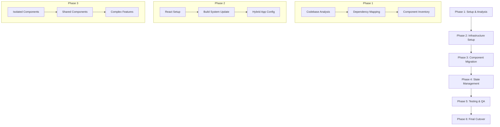

# Migration Plan: AngularJS to React

## Overview
This document outlines the strategy for migrating the Taiga frontend from AngularJS 1.5 to React. The migration will follow a gradual, component-by-component approach while maintaining system stability.

## Migration Strategy Visualization

## Detailed Phase Breakdown

### Phase 1: Setup & Analysis (2-3 weeks)
1. **Codebase Analysis**
   - Audit current AngularJS components
   - Identify component dependencies
   - Create component complexity matrix
   - Document current state management patterns

2. **Technical Stack Selection**
   - React 18+
   - TypeScript for type safety
   - React Router for routing
   - Redux Toolkit or Zustand for state management
   - Jest and React Testing Library for testing
   - Vite for build system

3. **Risk Assessment**
   - Identify critical user paths
   - Document integration points
   - List potential breaking points

### Phase 2: Infrastructure Setup (3-4 weeks)
1. **New Build System Setup**
   - Configure Vite for React
   - Set up TypeScript
   - Configure hybrid build system (Gulp + Vite)
   - Establish shared configuration

2. **Development Environment**
   - Set up React development environment
   - Configure hot reloading
   - Establish build pipelines
   - Create development proxy for API calls

3. **Hybrid Application Structure**
   - Configure ngReact for hybrid operation
   - Set up routing coexistence
   - Establish shared state pattern
   - Create communication bridge between AngularJS and React

### Phase 3: Component Migration (12-16 weeks)
1. **Migration Priority Order**
   1. Isolated components (no complex dependencies)
   2. Shared components (reusable UI elements)
   3. Feature components (complex business logic)
   4. Route-level components
   5. Core application structure

2. **Component Migration Process**
   - Create React component shell
   - Port template to JSX
   - Convert controller logic to hooks
   - Migrate tests
   - Verify functionality
   - Remove AngularJS component

3. **Shared Components Library**
   - Create React component library
   - Implement design system
   - Document components
   - Create storybook instances

### Phase 4: State Management (4-6 weeks)
1. **State Management Migration**
   - Set up Redux Toolkit/Zustand
   - Create state migration utilities
   - Migrate services to React hooks
   - Establish API integration layer

2. **Data Flow Patterns**
   - Implement React Query for API caching
   - Create shared state interfaces
   - Migrate complex state logic
   - Set up state persistence

### Phase 5: Testing & QA (Ongoing)
1. **Testing Strategy**
   - Unit tests with Jest
   - Integration tests with React Testing Library
   - E2E tests with Cypress
   - Performance testing

2. **Quality Assurance**
   - Feature parity verification
   - Performance benchmarking
   - Cross-browser testing
   - Accessibility testing

### Phase 6: Final Cutover (2-3 weeks)
1. **Cleanup**
   - Remove AngularJS dependencies
   - Clean up hybrid configuration
   - Optimize bundle size
   - Remove legacy code

2. **Performance Optimization**
   - Code splitting
   - Lazy loading
   - Bundle analysis
   - Performance monitoring

3. **Documentation**
   - Update technical documentation
   - Create maintenance guides
   - Document architecture decisions
   - Update deployment procedures

## Timeline and Resources

### Estimated Timeline
- Total Duration: 24-32 weeks
- Parallel development period: 16-20 weeks
- Final cutover: 2-3 weeks

### Resource Requirements
1. **Development Team**
   - 2-3 React developers
   - 1-2 AngularJS developers
   - 1 QA engineer
   - 1 Technical lead

2. **Infrastructure**
   - Development environments
   - CI/CD pipeline updates
   - Testing infrastructure
   - Monitoring tools

## Risk Mitigation

### Key Risks
1. Business continuity during migration
2. Performance degradation in hybrid mode
3. Feature parity gaps
4. Data consistency between old and new components

### Mitigation Strategies
1. Gradual migration with feature flags
2. Comprehensive testing at each phase
3. Regular stakeholder reviews
4. Rollback procedures for each phase
5. Monitoring and alerting setup

## Success Criteria
1. All AngularJS components migrated to React
2. Performance metrics meet or exceed current levels
3. All tests passing in new architecture
4. No regression in user experience
5. Documentation updated and complete
6. Team trained on new stack

## Rollback Plan
1. Feature flags for new components
2. Version control checkpoints
3. Database schema versioning
4. Client-side storage migration plan
5. Communication plan for stakeholders

This migration plan provides a structured approach to modernizing the Taiga frontend while maintaining system stability and user experience. Regular reviews and adjustments to the plan should be made as the migration progresses.