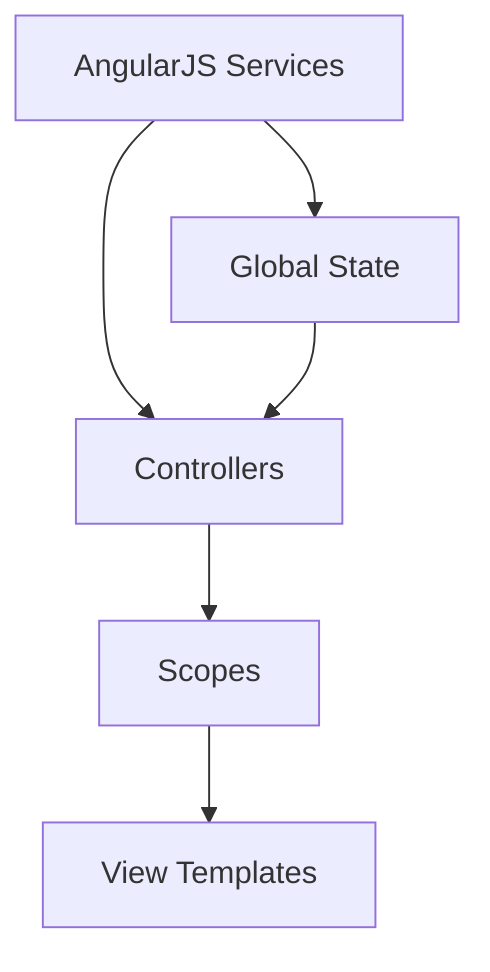
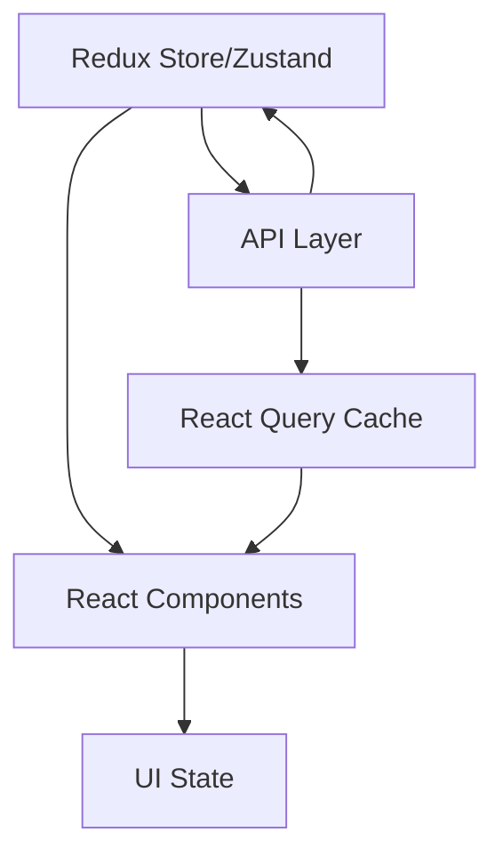
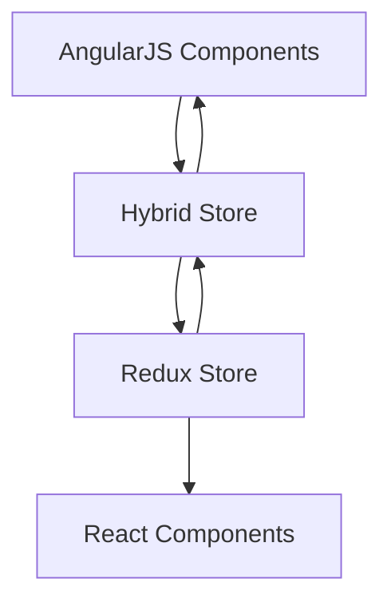

# State Management Migration Strategy

## Current State Analysis (AngularJS)


## Target State Architecture (React)


## Detailed Migration Strategy

### 1. State Management Technology Stack

#### Primary State Management
- **Redux Toolkit** or **Zustand** for global state
  - Redux Toolkit for larger, complex state with many interactions
  - Zustand for simpler, more direct state management
- **React Query** for server state management
- **React Context** for localized component state

#### Bridge Layer
- Custom state synchronization layer between AngularJS and React
- Event bus for cross-framework communication

### 2. Phase-wise Migration Approach

#### Phase 1: Setup and Infrastructure (2 weeks)
1. **Initial Setup**
   ```typescript
   // Example store setup with Redux Toolkit
   import { configureStore } from '@reduxjs/toolkit';
   
   export const store = configureStore({
     reducer: {
       // Initial empty reducers
     },
     middleware: (getDefaultMiddleware) =>
       getDefaultMiddleware().concat(/* custom middleware */)
   });
   ```

2. **Bridge Layer Implementation**
   ```typescript
   // Bridge service for AngularJS-React communication
   class StateBridge {
     private subscribers = new Map();
     
     emit(event: string, data: any) {
       if (this.subscribers.has(event)) {
         this.subscribers.get(event).forEach(cb => cb(data));
       }
     }
     
     subscribe(event: string, callback: Function) {
       if (!this.subscribers.has(event)) {
         this.subscribers.set(event, new Set());
       }
       this.subscribers.get(event).add(callback);
     }
   }
   ```

#### Phase 2: Service Migration (4-6 weeks)

1. **API Layer Migration**
   ```typescript
   // React Query service example
   import { useQuery, useMutation } from '@tanstack/react-query';
   
   export const useProjects = () => {
     return useQuery({
       queryKey: ['projects'],
       queryFn: () => api.getProjects()
     });
   };
   
   export const useUpdateProject = () => {
     return useMutation({
       mutationFn: (data) => api.updateProject(data),
       onSuccess: () => {
         queryClient.invalidateQueries(['projects']);
       }
     });
   };
   ```

2. **State Slice Migration**
   ```typescript
   // Redux slice example
   import { createSlice } from '@reduxjs/toolkit';
   
   const projectsSlice = createSlice({
     name: 'projects',
     initialState: {
       items: [],
       loading: false,
       error: null
     },
     reducers: {
       setProjects: (state, action) => {
         state.items = action.payload;
       },
       // ... other reducers
     }
   });
   ```

#### Phase 3: Component State Migration (8-10 weeks)

1. **Shared State Patterns**
   ```typescript
   // Custom hook combining local and global state
   const useProjectManagement = (projectId) => {
     const project = useSelector(state => state.projects[projectId]);
     const [localState, setLocalState] = useState({});
     
     return {
       project,
       localState,
       // ... combined actions
     };
   };
   ```

2. **Form State Management**
   ```typescript
   // Form management with React Hook Form
   import { useForm } from 'react-hook-form';
   
   const ProjectForm = () => {
     const { register, handleSubmit } = useForm();
     const updateProject = useUpdateProject();
     
     const onSubmit = (data) => {
       updateProject.mutate(data);
     };
   };
   ```

### 3. State Synchronization Patterns

#### Hybrid State Management
```typescript
// Example of hybrid state management during migration
angular.module('app').factory('hybridStore', function($rootScope) {
  return {
    dispatch: (action) => {
      store.dispatch(action);
      $rootScope.$broadcast('stateChanged', store.getState());
    },
    subscribe: (callback) => {
      return store.subscribe(() => {
        callback(store.getState());
      });
    }
  };
});
```

#### Data Flow Control


### 4. Testing Strategy

1. **Unit Tests**
   ```typescript
   // Redux store test example
   describe('projectsSlice', () => {
     it('should handle setProjects', () => {
       const initialState = { items: [] };
       const projects = [{ id: 1, name: 'Test' }];
       
       const newState = projectsReducer(
         initialState,
         setProjects(projects)
       );
       
       expect(newState.items).toEqual(projects);
     });
   });
   ```

2. **Integration Tests**
   ```typescript
   // Testing component with store
   it('renders projects from store', () => {
     render(
       <Provider store={store}>
         <ProjectList />
       </Provider>
     );
     
     expect(screen.getByText('Project 1')).toBeInTheDocument();
   });
   ```

### 5. Performance Optimization

1. **Selective Re-rendering**
   ```typescript
   // Memoization example
   const ProjectItem = memo(({ project }) => {
     return <div>{project.name}</div>;
   }, (prevProps, nextProps) => {
     return prevProps.project.id === nextProps.project.id;
   });
   ```

2. **State Normalization**
   ```typescript
   // Normalized state shape
   {
     entities: {
       projects: {
         byId: {
           '1': { id: '1', name: 'Project 1' },
           '2': { id: '2', name: 'Project 2' }
         },
         allIds: ['1', '2']
       }
     }
   }
   ```

## Migration Checklist

### Pre-migration
- [ ] Map all current AngularJS services and their dependencies
- [ ] Identify shared state requirements
- [ ] Document current state update patterns
- [ ] Create test coverage baseline

### During Migration
- [ ] Implement bridge layer
- [ ] Migrate services one at a time
- [ ] Add tests for new state management
- [ ] Monitor performance metrics
- [ ] Document new patterns and usage

### Post-migration
- [ ] Remove bridge layer
- [ ] Clean up any remaining AngularJS state management
- [ ] Optimize store configuration
- [ ] Update documentation
- [ ] Conduct performance review

## Success Metrics
1. State update performance (time)
2. Bundle size impact
3. Memory usage
4. Test coverage
5. Developer feedback on usability

This detailed state management migration strategy provides a clear path for transitioning from AngularJS to React while maintaining application stability and performance.